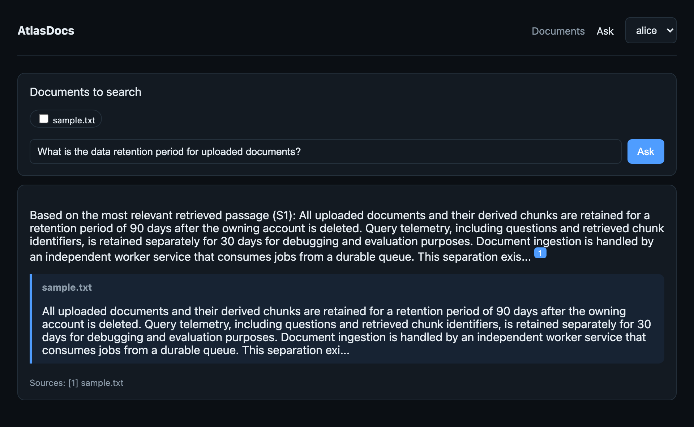
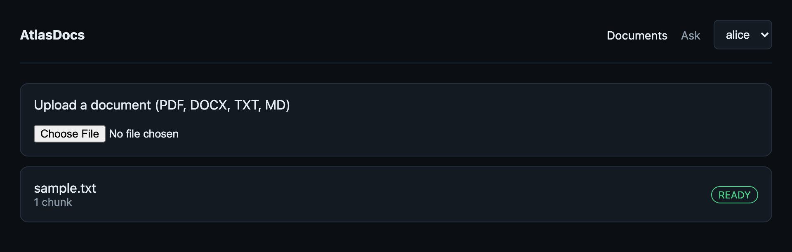
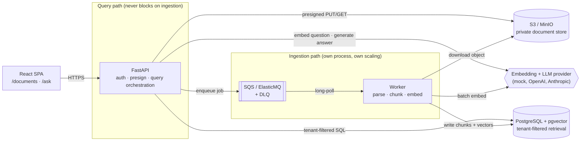

<div align="center">

# AtlasDocs

**A multi-tenant RAG platform where every answer is backed by a citation the backend actually verified — not one the model just claimed.**

[](backend)
[](backend/app/main.py)
[](backend/migrations)
[](frontend)
[](docker-compose.yml)
[](#architecture)
[](frontend)

[Quick start](#quick-start) •
[Architecture](#architecture) •
[Engineering highlights](#engineering-highlights) •
[Tests & evaluation](#tests--evaluation) •
[Status](#status)

</div>

---

Upload a PDF, DOCX, TXT, or Markdown file. Ask a question about it. Get an
answer with citations that point to the exact document, page, and excerpt
they came from — and that the backend rejects if the model hallucinates a
source that was never in the retrieved context.

Under the hood: presigned uploads straight to object storage, an
independent worker queue so ingestion never competes with query latency,
tenant-filtered pgvector retrieval, and a labeled evaluation harness that
scores retrieval and citation quality on every run — the whole stack you'd
actually build for a production RAG system, running locally with **zero
API keys required**.

<table>
<tr>
<td width="50%">

**Ask a question, get a validated citation**


</td>
<td width="50%">

**Track ingestion status per document**


</td>
</tr>
</table>

<a id="engineering-highlights"></a>
## 🧠 Engineering highlights

These are the design decisions worth bringing up in an interview — each
one maps to a specific file, not just a diagram box:

- **Ingestion is fully decoupled from the query path.** The API
  (`app/main.py`) and the worker (`app/workers/main.py`) are separate
  processes with separate Dockerfiles. Bulk uploads run on worker compute
  that can scale independently and can never starve an interactive query
  — see [`load-tests/query_vs_ingestion.py`](load-tests/query_vs_ingestion.py),
  the script that actually measures this instead of asserting it.
- **Tenant isolation is enforced in SQL, not application code.** Every
  retrieval query joins through `documents.owner_id` (see
  [`app/rag/retrieval.py`](backend/app/rag/retrieval.py)) — there is no
  code path where a missing `if` in Python could leak another tenant's
  vectors to the generator.
- **Citations are validated server-side before they ever reach the
  client.** The LLM returns structured `source_id`s; anything it cites
  that wasn't actually in the supplied context is silently dropped, never
  surfaced (see [`app/rag/citations.py`](backend/app/rag/citations.py) +
  its dedicated test file).
- **At-least-once delivery is treated as a fact, not an edge case.** The
  worker claims jobs with a compare-and-set status transition
  (`QUEUED → PROCESSING`), so a duplicate SQS delivery becomes a no-op
  instead of double-processing a document.
- **Re-ingestion never makes a document temporarily unqueryable.** New
  chunks are written under a new `processing_version`; the old version
  stays live until the new one fully succeeds.
- **Every embedding/generation provider sits behind an interface**, with a
  deterministic, dependency-free default so the whole pipeline is
  answerable with zero API keys — swap in OpenAI/Anthropic with one env
  var when you want real model quality.
- **HNSW is opt-in, not default.** Exact nearest-neighbor search is the
  checked-in evaluation baseline; approximate search is a separate,
  clearly-labeled migration you turn on *after* benchmarking recall
  against it — not a default nobody measured.

<a id="architecture"></a>
## 🏗 Architecture



The API and the worker are separate containers on purpose — that
separation *is* the architecture. Locally, MinIO stands in for S3 and
ElasticMQ stands in for SQS, both driven through the exact same boto3
client code that would run against real AWS, so nothing here is a mock of
the *infrastructure* — only of the *cloud provider*.

<details>
<summary><strong>Component responsibilities</strong></summary>

| Component | Responsibility |
|---|---|
| React | Upload UI, ingestion status polling, question UI, citation panel |
| FastAPI (`app/main.py`) | Auth, presigned uploads, document CRUD, query orchestration |
| Worker (`app/workers/main.py`) | Long-poll the queue; parse, chunk, embed, persist |
| PostgreSQL + pgvector | Relational metadata + tenant-filtered vector retrieval in one transactional store |
| S3 / MinIO | Private object storage; browsers upload directly via presigned URLs, never through the API |
| SQS / ElasticMQ | Durable, at-least-once ingestion queue with a dead-letter queue |
| Embedding / generation adapters | Provider-neutral interfaces — mock by default, OpenAI/Anthropic behind one env var each |

</details>

<a id="quick-start"></a>
## 🚀 Quick start

```bash
git clone https://github.com/shah-jinay/AtlasDocs.git && cd AtlasDocs
cp .env.example .env
docker compose up -d --build

curl http://localhost:8000/health          # {"status": "ok"}
open http://localhost:5173                 # the app

# Give it something to answer questions about
pip install -r backend/requirements.txt
python scripts/ingest_fixture.py
```

Open the app, ask *"What is the data retention period?"* on the `/ask`
page, and watch a real citation come back pointing at the fixture
document. The user switcher (top right) toggles between two demo
accounts — see [Auth](#auth) below.

**Zero API keys needed:** `EMBEDDING_PROVIDER=mock` and
`GENERATION_PROVIDER=mock` (both defaults) are deterministic, real,
grounded implementations — not stubs that fake success — so the full
pipeline is answerable out of the box. Flip either to `openai` /
`anthropic` in `.env` once you want production-grade answer quality.

<a id="tests--evaluation"></a>
## 🧪 Tests & evaluation

```bash
cd backend && pip install -r requirements-dev.txt && pytest
#   29 unit tests — chunker, parser, citation validation, generation
#   parsing, embedding provider. None of these touch Docker.

docker compose up -d --build
ATLASDOCS_INTEGRATION=1 pytest tests/test_integration_e2e.py -v
#   4 end-to-end tests against the real, running stack: upload → READY →
#   grounded citation → abstention → idempotent re-completion.
```

```bash
python scripts/ingest_fixture.py && python evaluation/run_eval.py
#   Recall@K, MRR, Precision@K, citation precision/recall, an automated
#   answer-accuracy proxy, and abstention accuracy — written to
#   evaluation/runs/<timestamp>-<git-sha>.json so results are diffable
#   across commits.

python load-tests/query_vs_ingestion.py --duration 120 --qps 2 --bulk-docs 20
#   Client-observed query p50/p95/p99 with vs. without concurrent bulk
#   ingestion, plus a pass/fail verdict against a threshold you set.
```

<details>
<summary><strong>Repository layout</strong></summary>

```
backend/app/
  api/        FastAPI routers (documents, query, health)
  core/       settings, structured logging, auth
  db/         SQLAlchemy models, repositories
  ingestion/  parser, chunker, embedding batching, pipeline orchestration
  rag/        embedding/generation provider interfaces, retrieval SQL,
              prompt/context packing, citation validation
  storage/    S3-compatible adapter (MinIO locally, S3 in AWS)
  queue/      SQS-compatible adapter (ElasticMQ locally, SQS in AWS)
  workers/    the long-polling ingestion worker entrypoint
backend/migrations/   Alembic; 0001 = baseline schema (exact search),
                       0002 = opt-in HNSW index (run after benchmarking)
backend/tests/        unit tests (no infra) + a gated e2e suite (needs the stack up)
frontend/src/         React app: /documents, /documents/:id, /ask
evaluation/           labeled dataset (JSONL), metrics.py, run_eval.py
load-tests/           query_vs_ingestion.py — the concurrent-load benchmark
scripts/              ingest_fixture.py (bootstraps a stable corpus)
fixtures/             sample.txt used by tests, eval, and the demo
```

</details>

<details>
<summary><strong>Changing the embedding model</strong></summary>

The embedding dimension is baked into the `document_chunks.embedding`
column at migration time (`EMBEDDING_DIMENSION=384`, matching the mock
provider). Switching to a model with a different native dimension (e.g.
OpenAI's `text-embedding-3-small` at 1536) requires:

1. Set `EMBEDDING_PROVIDER=openai`, `EMBEDDING_DIMENSION=1536`, `OPENAI_API_KEY` in `.env`.
2. Write a new migration changing the `vector(...)` column size (or drop and recreate it in dev).
3. Re-ingest existing documents — a `processing_version` bump, not an in-place vector rewrite.

</details>

<details>
<summary><strong>Enabling HNSW</strong></summary>

Migration `0001` intentionally does not create an ANN index — exact
nearest-neighbor search is the evaluation baseline. Once
`evaluation/run_eval.py` has a baseline result on real data:

```bash
cd backend && alembic upgrade 0002    # CONCURRENTLY-created HNSW index
```

No application code changes — pgvector picks the index transparently.
Compare recall/latency against the exact-search baseline before treating
it as the production configuration.

</details>

<a id="auth"></a>
<details>
<summary><strong>Auth (demo-grade)</strong></summary>

`backend/app/core/security.py` maps a static bearer token to a user via
`DEV_API_KEYS` in `.env`. This is enough to demonstrate real tenant
isolation (every retrieval query filters on `owner_id`) without building a
login system. Swap it for real OAuth2/JWT/session auth before this is
anything but a portfolio/demo deployment — nothing downstream assumes a
particular auth mechanism.

</details>

<a id="status"></a>
## 📊 Status — what I actually verified

Performance and quality claims are only worth as much as the measurement
behind them. Here's exactly what's real today versus what's built and
ready to run:

| Claim | Status |
|---|---|
| End-to-end upload → parse → chunk → embed → retrieve → answer pipeline | ✅ Implemented, exercised by 4 passing e2e tests |
| Tenant-isolated vector retrieval | ✅ Implemented — isolation enforced in SQL, not app code |
| Citation-grounded, backend-validated responses | ✅ Implemented and unit-tested |
| Idempotent, at-least-once-safe ingestion worker | ✅ Implemented and covered by an idempotency test |
| Evaluation harness (Recall@K, MRR, citation precision/recall) | ✅ Implemented; ships with a **4-question starter dataset** — grow it before quoting a score |
| Exact-vs-HNSW recall/latency benchmark | 🔲 Migration built and confirmed to apply cleanly; **no benchmark numbers exist yet** |
| "Query latency stays flat during bulk ingestion" | 🔲 Load-test script built and confirmed working; **no percentile numbers exist yet** |
| Deployed on AWS (ECS/RDS/real S3+SQS) | 🔲 Not built in this repo — local-stack only so far |

I'd rather a reviewer find this table than find an unverifiable number on
a resume. Every ✅ above was actually run against the live stack, not
just written and assumed to work.

## 🗺 Roadmap

- [ ] Run the exact-vs-HNSW benchmark on a real corpus and commit the result
- [ ] Run the load test against a real bulk-upload batch and commit the result
- [ ] Grow the evaluation dataset past 4 questions
- [ ] Terraform/CDK for ECS + RDS + S3 + SQS, deployed to a real AWS account
- [ ] Swap demo-grade auth for real OAuth2/session auth

## Environment variables

See [`.env.example`](.env.example) for the full list with inline
documentation (`backend/app/core/config.py` is the source of truth).

---

<div align="center">

Built by [Jinay Shah](mailto:jinayusa@gmail.com)

</div>
